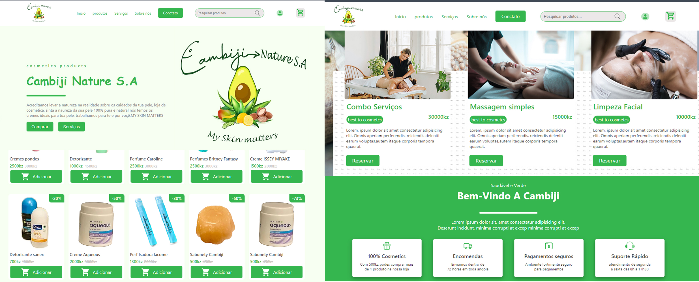

## <h1 align="center"> Cambiji-Nature </h1>

  Project exclusivo and free, for me make on Unydevtch comnunity as test to diagnósticts at lenguages to HTML,CSS and javascript .  
  Projecto excluisivo e livre, feito por min na Unydevtch comnunity como teste de diagnóstico nas linguagens de HTML CSS e Javascritp. 

  <a href="#-tecnologias">Tecnologias</a>&nbsp;&nbsp;&nbsp;|&nbsp;&nbsp;&nbsp;
  <a href="#-projeto">Projeto</a>&nbsp;&nbsp;&nbsp;|&nbsp;&nbsp;&nbsp;
  <a href="#-layout">Layout</a>&nbsp;&nbsp;&nbsp;|&nbsp;&nbsp;&nbsp;
  <a href="#memo-licença">Licença</a>

  

 

  

## 🚀 Tecnologias

Esse projeto foi desenvolvido com as seguintes tecnologias:

- HTML 
- CSS  
- javascript
- Git e Github

## 💻 Projeto

  A Cambiji-Nature é um site de vendas de produtos cosmeticos(produtos diversos da pele), e também permite fazer reserva de serviços diversos relacionado a lazer e do corpo.

- [Acesse o projeto finalizado, online](https://francisco-dos-santos.github.io/projetoCambiji/)

## 🔖 Layout
 para acessá-lo. Clica no link anterior

## :memo: Licença

Esse projeto existe e já está em funcionamento no mercado, qualquer copia da empresa, 
  desde a logo até as informações irrelevantes é passível nos termos da lei de crime segundo Nº 2 Art 20º.  

